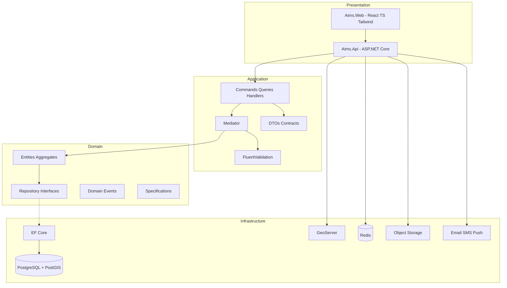

# 01 — Solution Architecture

## 1. Mission

**AIMS** digitizes the Philippine LGU Assessor lifecycle: receiving supporting documents, validating owners/properties, GIS and tax mapping, inspection, FAAS, appraisal, assessment, municipal recommendation/approval, provincial review/approval, tax declaration issuance, release, and archival — with digital signatures, full versioning, and municipal–provincial synchronization.

### Primary objectives

| Objective | Architectural response |
| --- | --- |
| Digital transformation | Paperless transaction workspace with document DMS |
| Paperless workflow | Receiving → Release stateful workflow engine |
| GIS native | PostGIS + GeoServer + OpenLayers as first-class module |
| Digital signatures | Signature service + certificate metadata + QR verify |
| Municipal ↔ Provincial sync | Sync bounded context, revision protocol, never overwrite |
| Cloud ready | Containerized modular monolith, externalized config |
| Offline ready | Encoder/inspection offline pack + conflict merge on sync |
| Enterprise security | JWT + refresh, RBAC matrix, encryption, rate limits, 2FA-ready |
| Complete audit trail | Immutable audit events for click/edit/print/login/approval/sign/sync |
| High availability | Stateless API, Redis session/cache, Postgres HA, object storage |
| Multi-tenant ready | TenantId on all aggregates; schema-per-tenant optional later |

---

## 2. System type

```text
Cloud Native · Modular Monolith · Future Microservice Ready
```

- **Today:** one deployable API host (`Aims.Api`) composing modules via DI.
- **Tomorrow:** extract modules (Sync, GIS, Notifications) to services behind the same contracts.

---

## 3. Clean Architecture layers



### Layer rules

| Layer | May depend on | Must not depend on |
| --- | --- | --- |
| Domain | Nothing external | EF, HTTP, UI, Redis |
| Application | Domain | Infrastructure concrete types |
| Infrastructure | Application + Domain | UI |
| Presentation/API | Application contracts | Domain persistence details |

---

## 4. Technology map

| Concern | Choice |
| --- | --- |
| UI | React, TypeScript, TailwindCSS, OpenLayers |
| API | ASP.NET Core Web API |
| Application patterns | CQRS + Mediator + Validation + DTO |
| Persistence | EF Core + PostgreSQL |
| Spatial | PostGIS + GeoServer (+ QGIS desktop for advanced edit) |
| Cache / queues | Redis |
| Files | S3-compatible Object Storage |
| Auth | JWT access + refresh tokens |
| Docs | Swagger / OpenAPI |

---

## 5. Modular monolith module map

Each module owns: Domain types, Application use cases, Infrastructure adapters (registered in composition root), API controllers/endpoints.

| Module | Bounded context |
| --- | --- |
| IdentityAccess | Users, roles, permissions, sessions |
| Receiving | Intake, checklists, transaction creation |
| Registry | Owner, Property, Parcel registries |
| GisTaxMapping | Parcels, layers, tax map, spatial ops |
| Inspection | Field inspection orders & results |
| AppraisalFaas | Land/building appraisal, FAAS drafts |
| Assessment | Assessment computation & records |
| WorkflowApprovals | Recommend → approve → sign (muni/province) |
| TaxDeclaration | TD generation, print, release |
| Documents | DMS versions, checksum, QR, archive |
| Sync | Municipal ↔ Provincial revision sync |
| Notifications | In-app, email, SMS-ready, push |
| Reporting | Rolls, registers, analytics |
| Audit | Immutable audit log |
| Tenancy | Tenant resolution, settings |
| Platform | Backup metadata, health, feature flags |

---

## 6. Cross-cutting concerns

- **CorrelationId** on every request and audit row
- **TenantId** on every aggregate root
- **Soft delete** + audit columns (`CreatedBy/At`, `UpdatedBy/At`, `DeletedBy/At`)
- **UUID** primary keys
- **Outbox** for domain events → sync/notifications
- **Idempotency keys** on sync and payment-like operations

---

## 7. Quality attributes

| Attribute | Strategy |
| --- | --- |
| Scalability | Stateless API; horizontal pods; Redis; read replicas |
| Availability | Health checks; rolling deploy; DB failover; object storage redundancy |
| Integrity | Version-everything; never overwrite; soft delete |
| Traceability | Audit + revision history + print history |
| Security | Defense in depth (see Security Architecture) |
| Maintainability | SOLID, DRY, KISS, module boundaries, tests |

---

## 8. Explicit originality statement

AIMS is an **original** architecture derived from standard Philippine LGU Assessor process patterns (receiving, FAAS, assessment, municipal/provincial approval, tax declaration). It does **not** copy proprietary commercial product UX, schemas, or internals.
