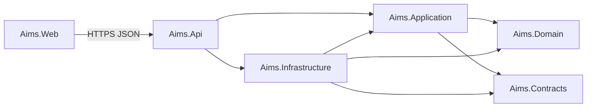
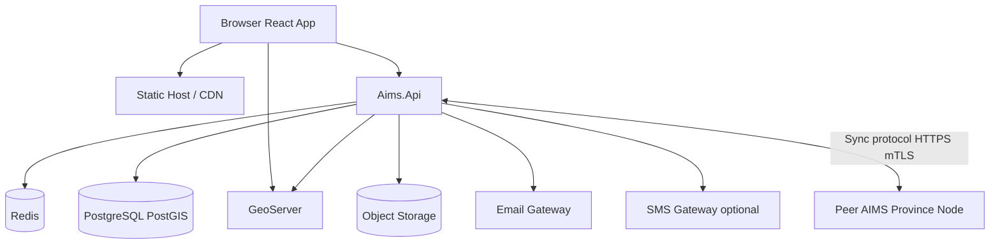
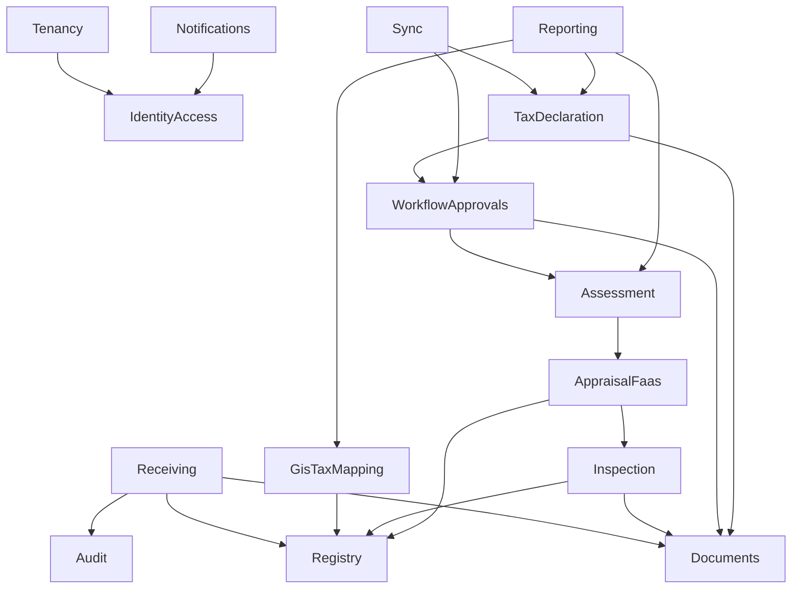
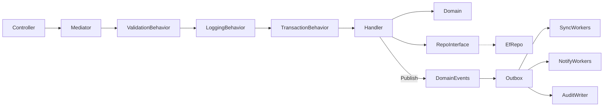

# 03 — Dependency Graph

## 1. Layer dependency graph (allowed)

**Rule:** Domain has zero project references outward. Infrastructure implements Domain interfaces; Application never references Infrastructure types (only abstractions).

---

## 2. Runtime dependency graph

---

## 3. Module dependency rules

### Hard rules

1. **No circular module references.** Use domain events / outbox for reverse notifications.
2. **Audit** and **Documents** are leaf infrastructure-facing services consumed by others.
3. **Sync** may read Workflow + TaxDeclaration aggregates but must not own appraisal math.
4. **GIS** must not own owner identity; it references Parcel/Property IDs from Registry.

---

## 4. CQRS internal graph

---

## 5. Package dependency (NuGet / npm intent)

### Backend (illustrative)

| Package | Used by |
| --- | --- |
| MediatR (or equivalent mediator) | Application |
| FluentValidation | Application |
| EF Core + Npgsql + NetTopologySuite | Infrastructure |
| StackExchange.Redis | Infrastructure |
| AWSSDK.S3 / MinIO SDK | Infrastructure |
| Serilog | Api + Infrastructure |
| Swashbuckle / NSwag | Api |

### Frontend

| Package | Used by |
| --- | --- |
| React + TypeScript | Web |
| TailwindCSS | Web |
| OpenLayers | gis package |
| React Query / TanStack Query | API state |
| Zod | client validation |

---

## 6. Forbidden dependencies

| From | To | Why |
| --- | --- | --- |
| Domain | EF Core | Persistence leak |
| Application | Controllers | UI/API leak |
| Web | Database | Bypass API |
| GisTaxMapping | TaxDeclaration print templates | Wrong ownership |
| Sync | UI components | Layer violation |
