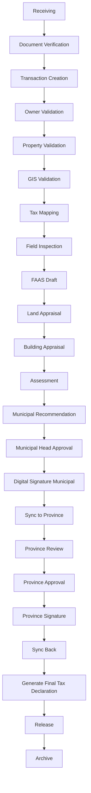
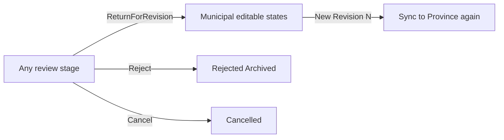

# 06 — System Flow

## End-to-end Assessor transaction flow

---

## Stage definitions

| Stage | Actor(s) | System actions | Artifacts |
| --- | --- | --- | --- |
| Receiving | Receiving Clerk | Log visitor, collect packet, stamp received | Receiving log, DocumentObjects |
| Document Verification | Records / Receiving | Checklist completeness, checksum store | Verified checklist |
| Transaction Creation | Receiving / Encoder | Create `AssessorTransaction` + type | Transaction No. |
| Owner Validation | Encoder / Records | Match/create Owner, SPA checks | Owner link |
| Property Validation | Encoder / Appraiser | Match PropertyUnit / create draft | Property link |
| GIS Validation | GIS Officer | Geometry exists, overlaps check | Spatial flags |
| Tax Mapping | Tax Mapper | PIN, sheet, control roll update | Tax map annotation |
| Field Inspection | Appraiser | Schedule, capture findings/photos | InspectionReport |
| FAAS Draft | Appraiser / Encoder | Create FAAS version 1 | FaasSheet rev |
| Land / Building Appraisal | Appraiser | Apply SMV/schedules | Appraisal lines |
| Assessment | Appraiser / Asst | Assessment levels → assessed value | AssessmentRecord |
| Municipal Recommendation | Asst / Municipal Assessor | Recommend approve/return | Workflow event |
| Municipal Head Approval | Municipal Head | Approve/reject | ApprovalPacket |
| Municipal Signature | Municipal Head | Digital sign + QR | SignatureRecord |
| Sync to Province | System / Muni Head | Push SyncEnvelope revision | Sync outbox |
| Province Review | Provincial Reviewer | Diff revisions, annotate | Review notes |
| Province Approval | Provincial Head | Approve/reject/return | ApprovalPacket |
| Province Signature | Provincial Head | Digital sign | SignatureRecord |
| Sync Back | System | Pull approved package | Sync inbox |
| Generate TD | System / Records | Render PDF TD + NOA | TaxDeclaration |
| Release | Records | Claim stub, release log | Release record |
| Archive | Records | Freeze versions, retention | Archive package |

---

## Return / reject loops

While status is **Pending Provincial Review**, municipality **may edit**; each save increments **Revision Number** and notifies province (see [07-SYNC-AND-VERSIONING.md](07-SYNC-AND-VERSIONING.md)).

---

## Transaction types (examples)

- Transfer of ownership (sale, donation, extrajudicial settlement, etc.)
- New discovery / first declaration
- Subdivision / consolidation
- Reassessment / revision of assessment
- Correction of entry
- Building/machinery declaration
- Certified copy request (lighter sub-flow; may skip GIS/inspection)
