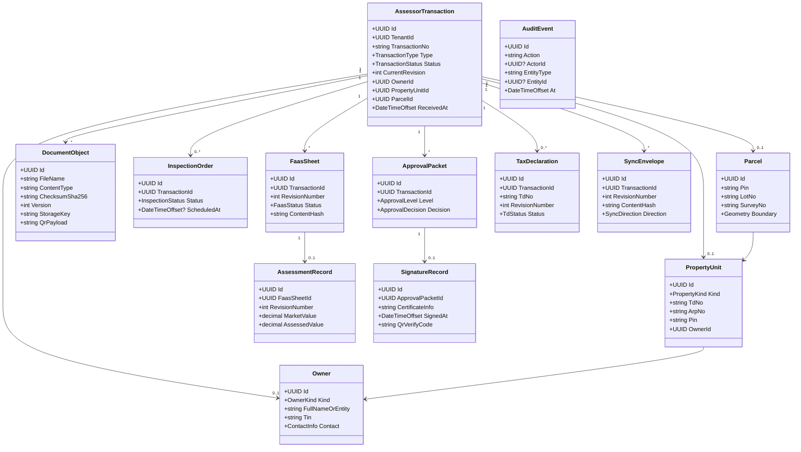
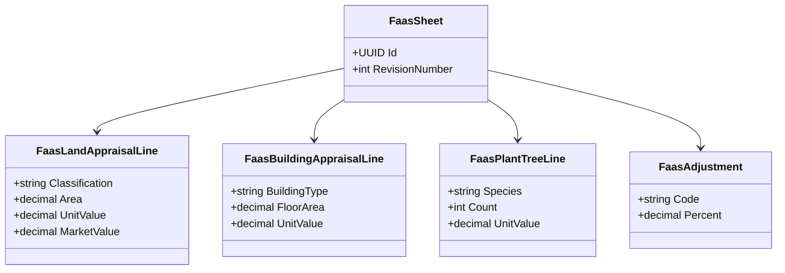
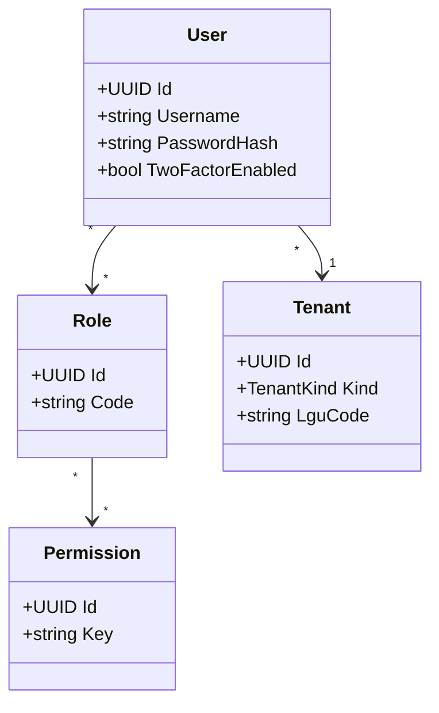

# 08 — UML Class Model

## 1. Core domain aggregates (logical UML)

```mermaid
classDiagram
  class AssessorTransaction {
    +UUID Id
    +UUID TenantId
    +string TransactionNo
    +TransactionType Type
    +TransactionStatus Status
    +int CurrentRevision
    +UUID OwnerId
    +UUID PropertyUnitId
    +UUID ParcelId
    +DateTimeOffset ReceivedAt
  }

  class Owner {
    +UUID Id
    +OwnerKind Kind
    +string FullNameOrEntity
    +string Tin
    +ContactInfo Contact
  }

  class PropertyUnit {
    +UUID Id
    +PropertyKind Kind
    +string TdNo
    +string ArpNo
    +string Pin
    +UUID OwnerId
  }

  class Parcel {
    +UUID Id
    +string Pin
    +string LotNo
    +string SurveyNo
    +Geometry Boundary
  }

  class DocumentObject {
    +UUID Id
    +string FileName
    +string ContentType
    +string ChecksumSha256
    +int Version
    +string StorageKey
    +string QrPayload
  }

  class InspectionOrder {
    +UUID Id
    +UUID TransactionId
    +InspectionStatus Status
    +DateTimeOffset? ScheduledAt
  }

  class FaasSheet {
    +UUID Id
    +UUID TransactionId
    +int RevisionNumber
    +FaasStatus Status
    +string ContentHash
  }

  class AssessmentRecord {
    +UUID Id
    +UUID FaasSheetId
    +int RevisionNumber
    +decimal MarketValue
    +decimal AssessedValue
  }

  class ApprovalPacket {
    +UUID Id
    +UUID TransactionId
    +ApprovalLevel Level
    +ApprovalDecision Decision
  }

  class SignatureRecord {
    +UUID Id
    +UUID ApprovalPacketId
    +string CertificateInfo
    +DateTimeOffset SignedAt
    +string QrVerifyCode
  }

  class TaxDeclaration {
    +UUID Id
    +UUID TransactionId
    +string TdNo
    +int RevisionNumber
    +TdStatus Status
  }

  class SyncEnvelope {
    +UUID Id
    +UUID TransactionId
    +int RevisionNumber
    +string ContentHash
    +SyncDirection Direction
  }

  class AuditEvent {
    +UUID Id
    +string Action
    +UUID? ActorId
    +string EntityType
    +UUID? EntityId
    +DateTimeOffset At
  }

  AssessorTransaction "1" --> "0..1" Owner
  AssessorTransaction "1" --> "0..1" PropertyUnit
  AssessorTransaction "1" --> "0..1" Parcel
  AssessorTransaction "1" --> "*" DocumentObject
  AssessorTransaction "1" --> "0..*" InspectionOrder
  AssessorTransaction "1" --> "*" FaasSheet
  FaasSheet "1" --> "0..1" AssessmentRecord
  AssessorTransaction "1" --> "*" ApprovalPacket
  ApprovalPacket "1" --> "0..1" SignatureRecord
  AssessorTransaction "1" --> "0..*" TaxDeclaration
  AssessorTransaction "1" --> "*" SyncEnvelope
  PropertyUnit --> Owner
  Parcel --> PropertyUnit
```

---

## 2. FAAS internal structure

```mermaid
classDiagram
  class FaasSheet {
    +UUID Id
    +int RevisionNumber
  }
  class FaasLandAppraisalLine {
    +string Classification
    +decimal Area
    +decimal UnitValue
    +decimal MarketValue
  }
  class FaasBuildingAppraisalLine {
    +string BuildingType
    +decimal FloorArea
    +decimal UnitValue
  }
  class FaasPlantTreeLine {
    +string Species
    +int Count
    +decimal UnitValue
  }
  class FaasAdjustment {
    +string Code
    +decimal Percent
  }

  FaasSheet --> FaasLandAppraisalLine
  FaasSheet --> FaasBuildingAppraisalLine
  FaasSheet --> FaasPlantTreeLine
  FaasSheet --> FaasAdjustment
```

---

## 3. Identity model

```mermaid
classDiagram
  class User {
    +UUID Id
    +string Username
    +string PasswordHash
    +bool TwoFactorEnabled
  }
  class Role {
    +UUID Id
    +string Code
  }
  class Permission {
    +UUID Id
    +string Key
  }
  class Tenant {
    +UUID Id
    +TenantKind Kind
    +string LguCode
  }

  User "*" --> "*" Role
  Role "*" --> "*" Permission
  User "*" --> "1" Tenant
```
