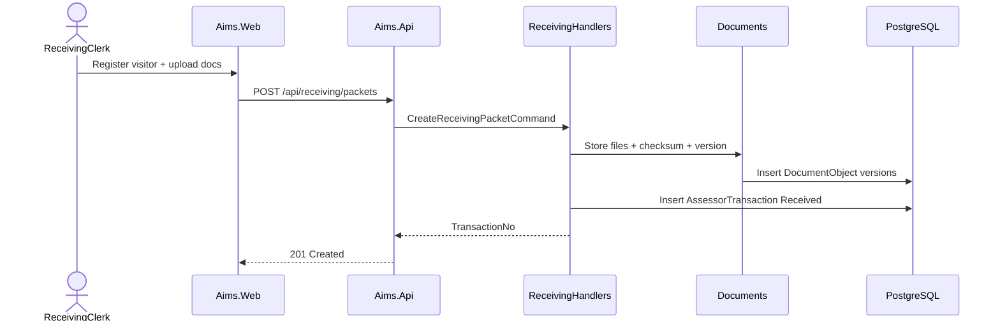
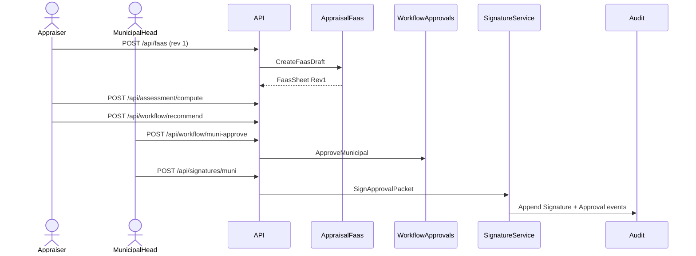
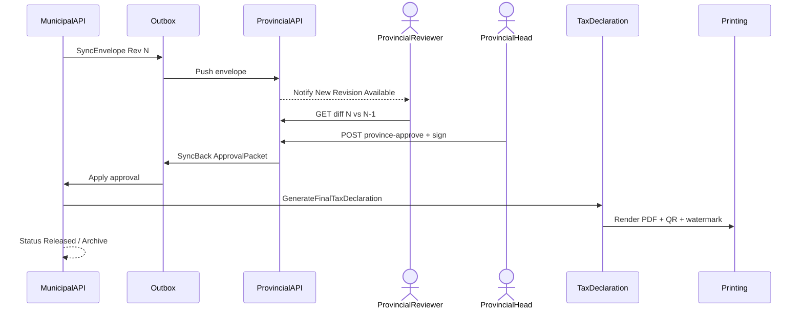
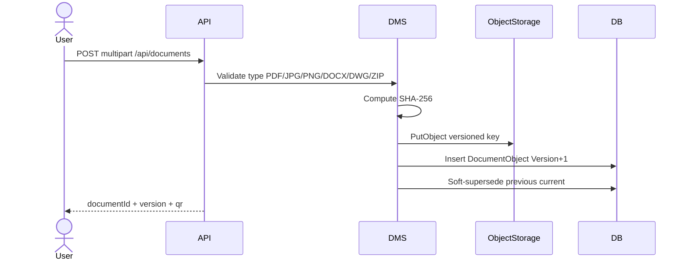
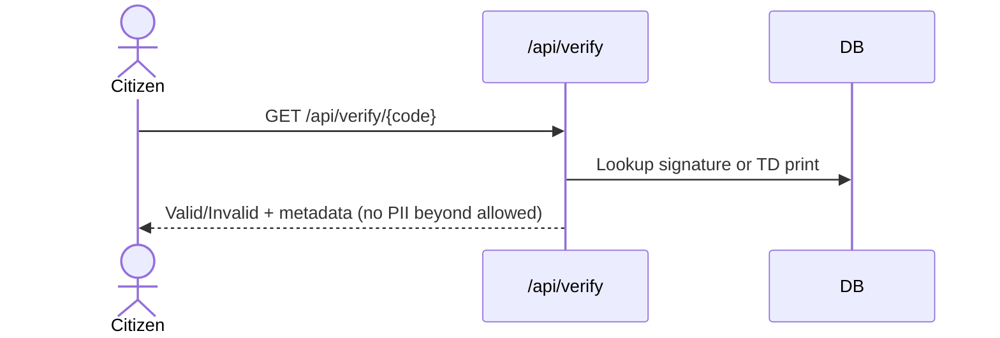
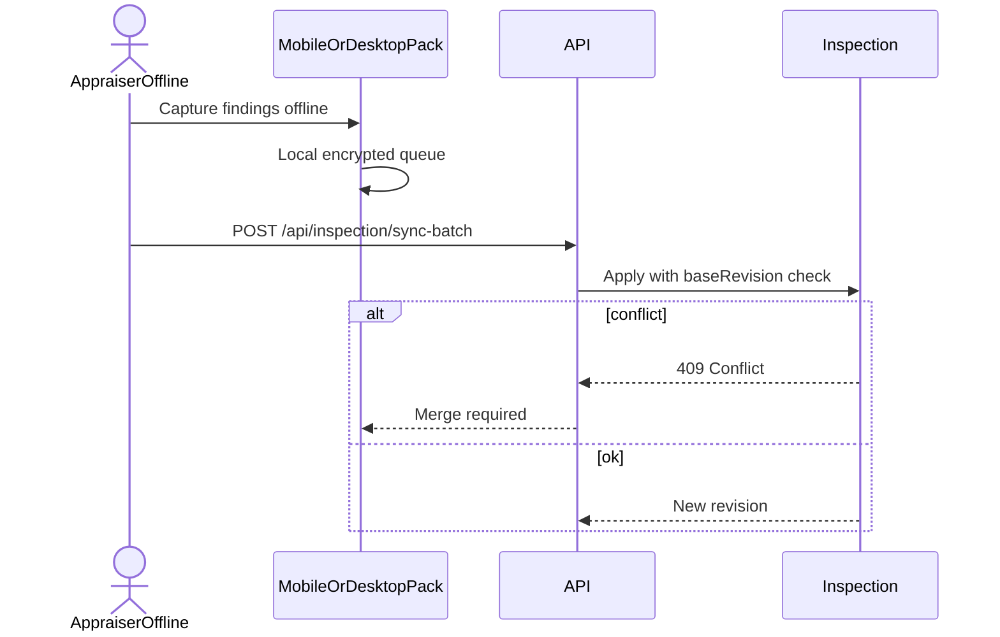

# 09 — Sequence Diagrams

## 1. Receiving → Transaction creation

---

## 2. FAAS draft → Municipal signature

---

## 3. Municipal sync → Province approve → Sync back → TD

---

## 4. Document upload with versioning

---

## 5. QR verification (public/internal)

---

## 6. Offline inspection sync

