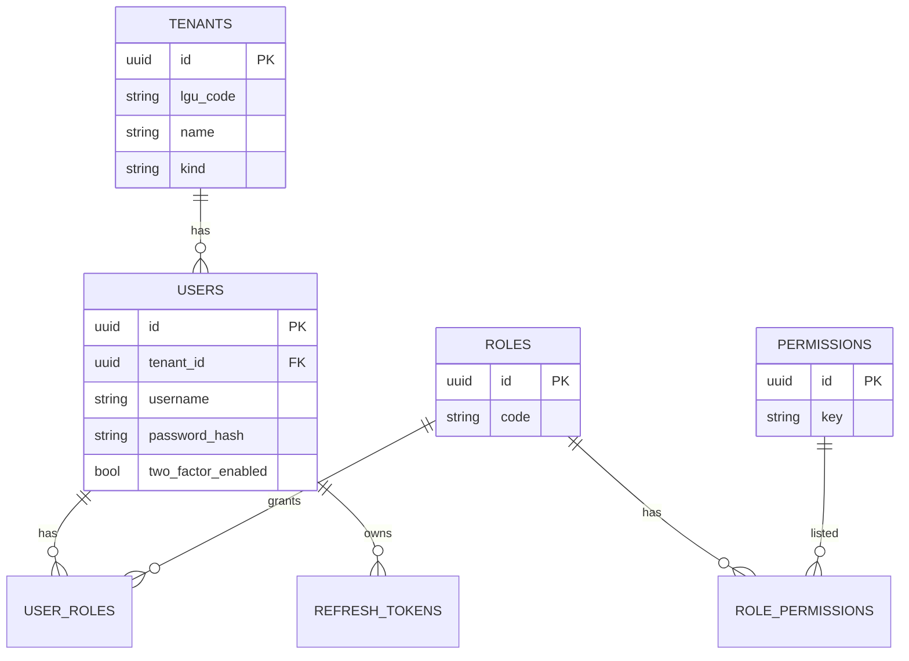
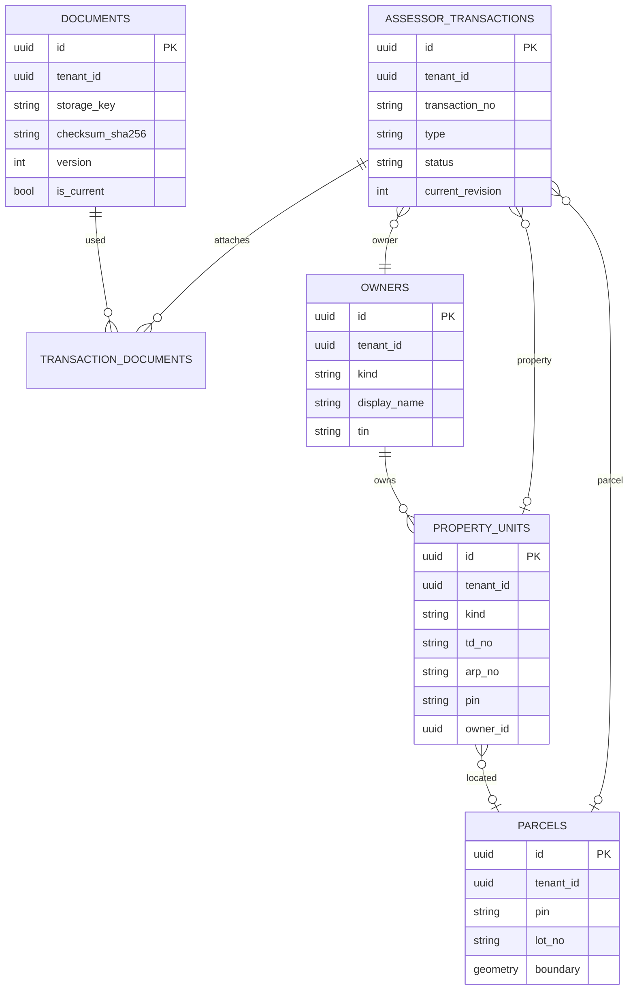
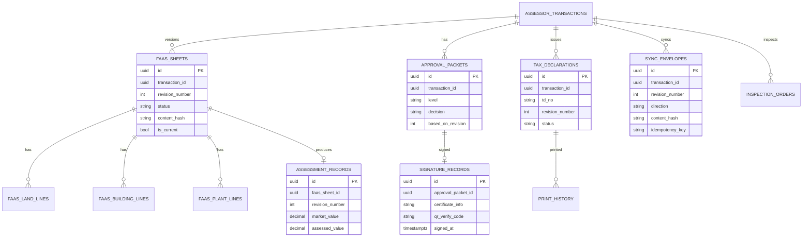
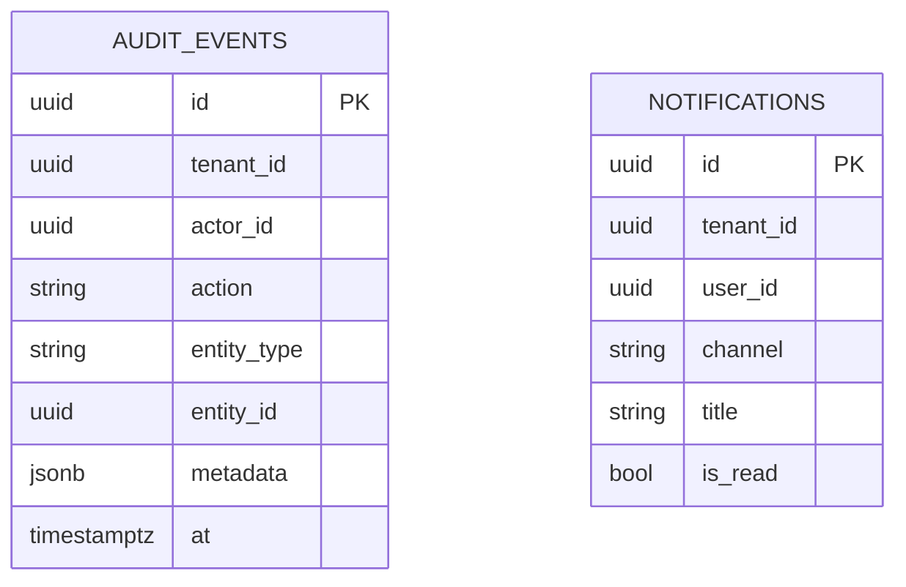

# 10 — ERD (Logical / Physical Intent)

## Conventions

- UUID primary keys
- Soft delete + audit columns on all business tables
- `tenant_id` on all tenant-owned tables
- Spatial columns via PostGIS (`geometry`)
- Versioned entities use `revision_number` + `is_current`

### Audit columns (all tables)

`created_by`, `created_at`, `updated_by`, `updated_at`, `deleted_by`, `deleted_at`, `is_deleted`

---

## 1. ERD — Identity & tenancy

---

## 2. ERD — Transaction spine & registries

---

## 3. ERD — FAAS, assessment, approvals, TD

---

## 4. ERD — Audit & notifications

---

## 5. Indexing (critical)

| Table | Indexes |
| --- | --- |
| `assessor_transactions` | `(tenant_id, status)`, `(transaction_no)` unique per tenant |
| `property_units` | `(tenant_id, pin)`, `(td_no)` |
| `parcels` | GiST on `boundary`; `(pin)` |
| `faas_sheets` | `(transaction_id, revision_number)` unique |
| `sync_envelopes` | unique `(idempotency_key)` |
| `audit_events` | `(tenant_id, at)`, `(entity_type, entity_id)` |
| `documents` | `(checksum_sha256)`, `(storage_key, version)` |
