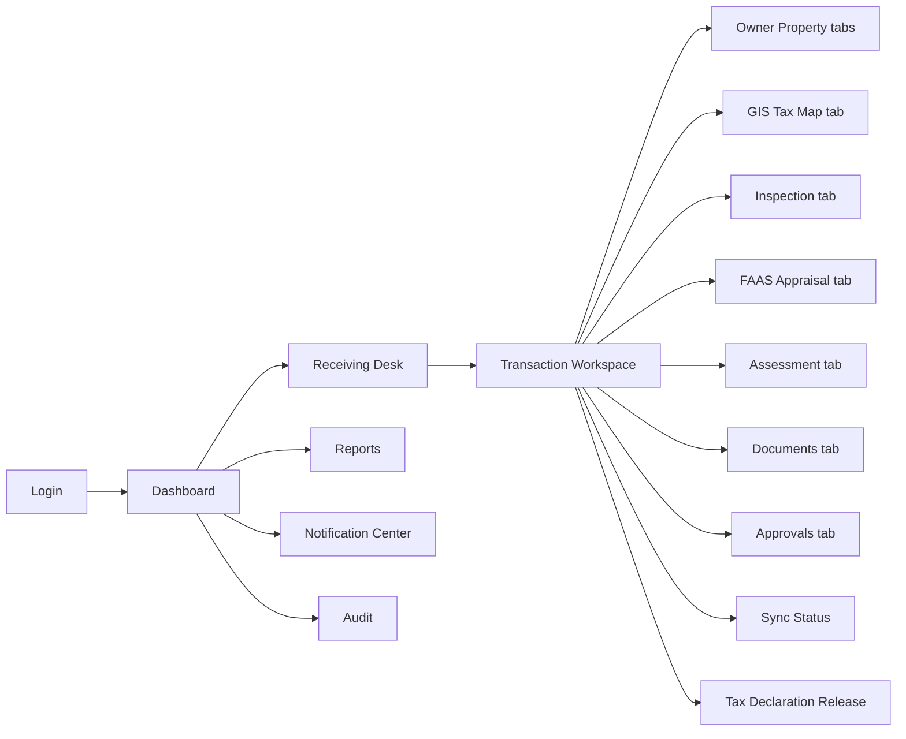
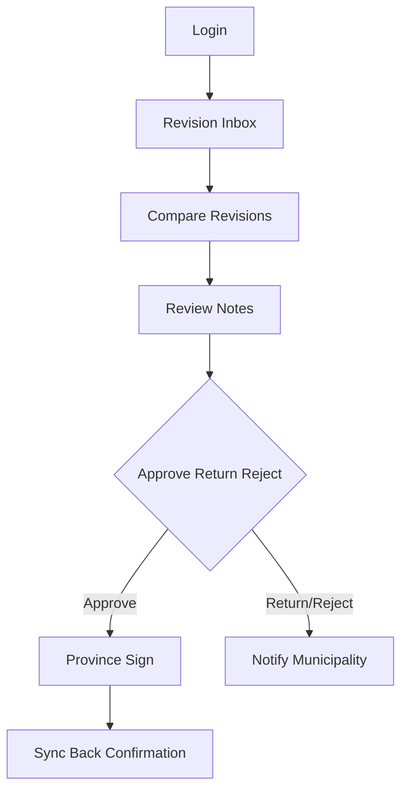

# 12 — UI Flow

## 1. Application shells

| Shell | Audience |
| --- | --- |
| Municipal Workspace | Receiving → Release users |
| Provincial Portal | Provincial reviewer/head queues |
| Admin Console | SYS_ADMIN |
| Public Verify | QR landing (minimal) |

---

## 2. Municipal primary UI flow

---

## 3. Transaction workspace (single composition)

One transaction screen with staged stepper matching system flow. Each step:

1. Shows required checklist
2. Blocks advance until validations pass (configurable)
3. Records audit on enter/complete
4. Shows **current revision** badge always

### Stepper labels

Receiving → Docs → Owner → Property → GIS → Tax Map → Inspection → FAAS → Appraisal → Assessment → Recommend → Approve → Sign → Sync → TD → Release → Archive

---

## 4. Provincial portal UI flow

---

## 5. Role-based landing

| Role | Default home |
| --- | --- |
| Receiving Clerk | Receiving Desk |
| Encoder / Appraiser | My Work Queue (FAAS/Inspection) |
| Tax Mapper / GIS Officer | GIS + Tax Mapping |
| Municipal Head | Approval Queue |
| Provincial Reviewer/Head | Province Inbox |
| Records Officer | Release & Archive |
| Auditor | Audit Explorer |
| SYS_ADMIN | Admin Console |

---

## 6. UX principles (enterprise LGU)

- Clear status + revision number in header
- Diff view mandatory before provincial approve
- Print preview before TD print (watermark, QR, signature block)
- Soft delete never shown as hard remove to clerks
- Offline banner for inspection pack with pending sync count
