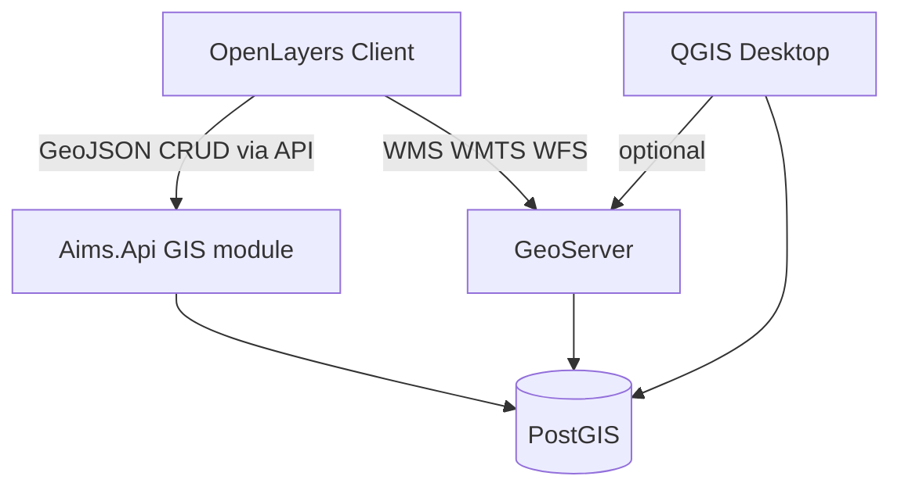

# 13 — GIS Architecture

## 1. Stack

| Tier | Technology |
| --- | --- |
| Frontend map | **OpenLayers** |
| Map server | **GeoServer** |
| Spatial DB | **PostgreSQL + PostGIS** |
| Desktop GIS | **QGIS** (advanced edit / QA; publish back via DB or WFS-T policy) |

---

## 2. Logical GIS architecture

---

## 3. Layers

| Layer | Source | Notes |
| --- | --- | --- |
| Province | Boundary polygon | Reference |
| Municipality | Boundary | Tenant clip |
| Barangay | Boundaries | Filter aid |
| Parcel | PostGIS parcels | Primary cadastral |
| Road | Optional OSM/LGU | Context |
| River | Optional | Context |
| Building | Footprints optional | Link to building units |
| Satellite | XYZ tiles | Basemap |
| Orthophoto | GeoServer coverage | Basemap |
| Tax Map | Sheet-oriented layer | PIN / control |

---

## 4. GIS features (product)

- Search Parcel / Search Owner
- Draw Polygon
- Split Parcel / Merge Parcel
- Measure Area
- GPS capture (field)
- Print Map
- Parcel History (geometry revisions)

All geometry edits create **new spatial revision** (aligned with version-everything policy).

---

## 5. Integration with assessor flow

| Flow stage | GIS responsibility |
| --- | --- |
| GIS Validation | Parcel exists; no illegal overlap; within barangay |
| Tax Mapping | Assign/verify PIN; update tax map control |
| Inspection | Optional GPS point on findings |
| Province review | Read-only map context + history |

---

## 6. Security for GIS

- GeoServer credentials not exposed to browser; use tokenized WMS or constrained public layers
- Write geometry only via Aims.Api (authorized GIS/Tax Mapper roles)
- Tenant spatial filter: municipality envelope constraint in queries
