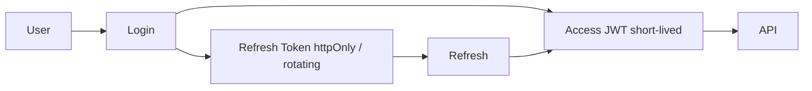

# 14 — Security Architecture

## 1. Security goals

Confidentiality of owner/property data, integrity of approvals/signatures, accountability via audit, availability under attack (rate limits).

---

## 2. Authentication

- Password policy: length, complexity, history, expiry (configurable)
- Lockout after N failures
- **2FA-ready** (TOTP) — enrollment endpoints reserved
- Session/device metadata logged

---

## 3. Authorization

- **RBAC** + permission matrix ([05-ROLES-AND-PERMISSIONS.md](05-ROLES-AND-PERMISSIONS.md))
- Policy-based ASP.NET authorization
- Tenant isolation on every query
- Optional record-level assignment scopes

---

## 4. Data protection

| Control | Approach |
| --- | --- |
| In transit | HTTPS / TLS 1.2+; mTLS for municipal↔provincial sync |
| At rest | DB encryption (volume/KMS); object storage SSE |
| Secrets | Vault / cloud secret manager; never in source |
| Files | Checksum SHA-256; malware scan hook optional |
| PII | Minimize in public verify responses |

---

## 5. Digital signature security

- Only Municipal Head / Provincial Head sign at their gates
- Signature payload includes: entity id, revision, content hash, cert info, timestamp
- Verification QR resolves to signature/TD metadata
- Signed revisions immutable

---

## 6. Audit (mandatory)

Log **every**: click (significant UI actions), edit, print, login, approval, signature, sync.

`AuditEvent` is append-only; no update/delete APIs for auditors except export.

---

## 7. Application hardening

- Input validation (FluentValidation)
- Output encoding in UI
- CORS allowlist
- Rate limiting
- Security headers (HSTS, CSP tailored for app)
- Swagger disabled or protected in production
- Dependency scanning in CI

---

## 8. Threat model (summary)

| Threat | Mitigation |
| --- | --- |
| Stolen JWT | Short TTL + refresh rotation + revoke |
| Privilege escalation | Permission checks server-side only |
| Tampered FAAS after sign | Content hash + immutable revisions |
| Sync spoofing | mTLS + idempotency + tenant allowlist |
| Data exfiltration | RBAC + audit + DLP-ready export logs |
