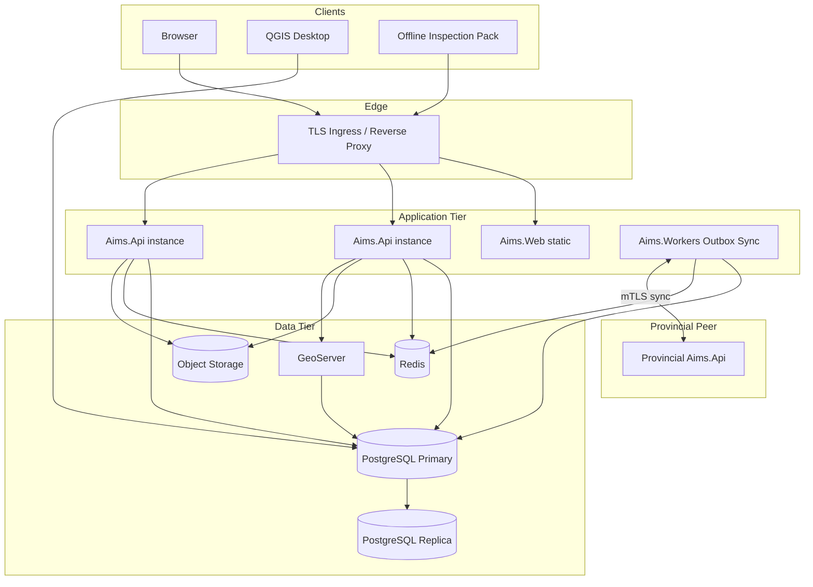
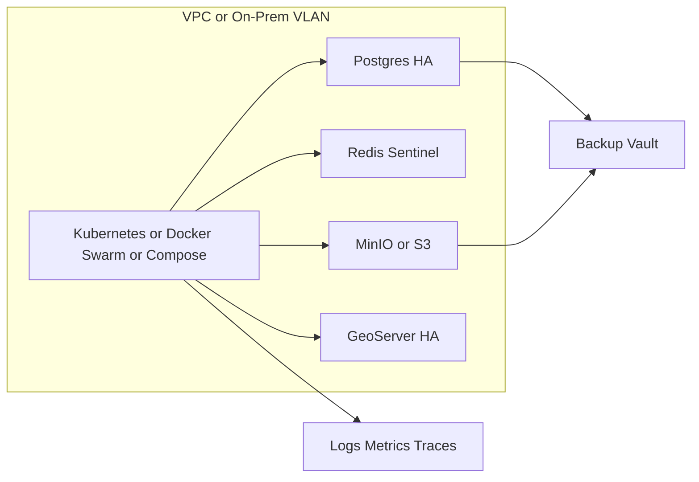

# 15 — Deployment & Infrastructure

## 1. Deployment diagram

---

## 2. Infrastructure diagram (cloud-ready LGU)

---

## 3. High availability

| Component | HA approach |
| --- | --- |
| API | 2+ replicas, rolling update, health probes |
| Web | CDN / multi-replica nginx |
| PostgreSQL | Primary + replica; automated failover |
| Redis | Sentinel/cluster |
| GeoServer | 2 nodes sharing PostGIS |
| Object storage | Erasure coding / cross-AZ |
| Sync workers | Competing consumers on outbox |

---

## 4. Backup & restore

| Schedule | Scope |
| --- | --- |
| Daily | Incremental DB + object changelog |
| Weekly | Full DB dump + object snapshot |
| Monthly | Archive freeze to cold storage |

**Restore Wizard** (Admin UI): select backup → validate checksum → restore to staging → promote.

---

## 5. Multi-tenant readiness

- `tenant_id` on all aggregates
- Municipal tenant ↔ Provincial tenant pairing in settings
- Future: schema-per-tenant or database-per-large-city without rewriting domain

---

## 6. Offline readiness

- Inspection/encoder offline pack caches assigned work
- Local encrypted queue
- Sync-batch endpoint with conflict protocol
- Read-only SMV tables packaged for field use

---

## 7. Environments

| Env | Purpose |
| --- | --- |
| Dev | Local compose |
| UAT | LGU UAT with anonymized data |
| Staging | Prod-like HA |
| Prod Municipal | Live municipal node |
| Prod Provincial | Live provincial node |

---

## 8. Observability

- Structured logs (Serilog) with CorrelationId
- Metrics: request rate, sync lag, queue depth
- Traces: OpenTelemetry
- Alerts: sync failure, disk, DB failover, certificate expiry
