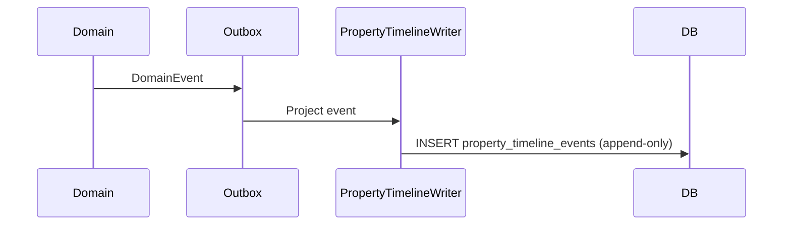

# 18 — Property Timeline

## Purpose

Every `PropertyUnit` has an immutable chronological timeline from creation to archival. Timeline is the **human-readable history** derived from domain events and version commits (not a mutable log).

## Event catalog

| Event code | Description |
| --- | --- |
| `PROPERTY_CREATED` | Property Created |
| `OWNER_CHANGED` | Owner Changed |
| `OWNERSHIP_TRANSFER` | Ownership Transfer |
| `SUBDIVISION` | Subdivision |
| `CONSOLIDATION` | Consolidation |
| `BOUNDARY_UPDATED` | Boundary Updated |
| `PARCEL_GEOMETRY_UPDATED` | Parcel Geometry Updated |
| `LAND_CLASSIFICATION_UPDATED` | Land Classification Updated |
| `ASSESSMENT_UPDATED` | Assessment Updated |
| `FAAS_GENERATED` | FAAS Generated |
| `TAX_DECLARATION_GENERATED` | Tax Declaration Generated |
| `CORRECTION_SUBMITTED` | Correction Submitted |
| `CORRECTION_APPROVED` | Correction Approved |
| `INSPECTION_CONDUCTED` | Inspection Conducted |
| `GIS_VALIDATION` | GIS Validation |
| `PROVINCIAL_REVIEW` | Provincial Review |
| `PROVINCIAL_APPROVAL` | Provincial Approval |
| `PRINTED` | Printed |
| `RELEASED` | Released |
| `ARCHIVED` | Archived |

## Entry schema

| Field | Type | Notes |
| --- | --- | --- |
| `OccurredAt` | timestamptz | Date and Time |
| `PerformedByUserId` | uuid | Performed By |
| `OfficeId` / `OfficeName` | uuid/text | Office |
| `MunicipalityCode` / Name | text | Municipality |
| `Action` | text / enum | Event code + label |
| `OldValue` | jsonb | Prior snapshot fragment |
| `NewValue` | jsonb | New snapshot fragment |
| `Reason` | text | Mandatory for corrections/transfers |
| `SupportingDocumentIds` | uuid[] | DMS links |
| `DigitalSignatureStatus` | enum | None / Pending / Signed / Invalid |
| `RevisionNumber` | int | Property or related aggregate revision |

## Capabilities

- **Searchable** — full-text on action, reason, actor, office; filter by event type, date range, actor, municipality, revision
- **Filterable** — multi-select event codes + severity tags if linked to conflicts
- **Printable** — government PDF timeline report
- **Exportable** — CSV / Excel / JSON

## Write path

Timeline rows are **append-only**. Corrections add new events; they never edit history.
