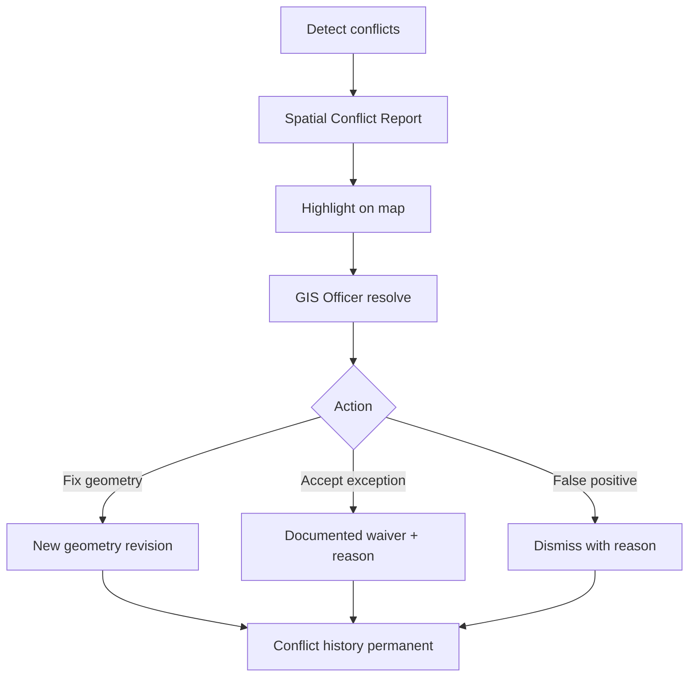

# 20 — Spatial Validation Rules

## When validation runs

- Before **Municipal Head Approval**
- Before **Provincial Approval** (re-check)
- On GIS save of geometry (pre-commit soft check)
- Nightly batch for estate-wide quality

Critical conflicts **block approval**. High may block or warn (tenant setting). Medium/Low warn only.

## Rules

| Code | Detection | Severity default |
| --- | --- | --- |
| `OVERLAPPING_PARCELS` | `ST_Overlaps` / `ST_Intersects` with area > epsilon (exclude touches) | Critical |
| `DUPLICATE_GEOMETRY` | `ST_Equals` or identical `geom_hash` | Critical |
| `SELF_INTERSECTING` | `NOT ST_IsValid` + self-intersection reason | Critical |
| `POLYGON_GAP` | Topology gap vs adjacent expected coverage (configurable) | High |
| `INVALID_POLYGON` | `NOT ST_IsValid(geom)` | Critical |
| `OUTSIDE_BARANGAY` | Not `ST_Within` / `ST_CoveredBy` barangay | Critical |
| `OUTSIDE_MUNICIPALITY` | Outside municipal boundary | Critical |
| `AREA_DIFFERENCE_THRESHOLD` | \|new−old\|/old > threshold% (settings) | High |
| `DUPLICATE_COORDINATES` | Repeated consecutive vertices / near-duplicate rings | Medium |
| `DUPLICATE_CENTROID` | Centroid within tolerance of another parcel | High |
| `DUPLICATE_SURVEY_INFO` | Same survey no + lot no different PIN | High |
| `DUPLICATE_PROPERTY_BOUNDARY` | Boundary matches another property unit link | Critical |

## Spatial Conflict Report

Auto-generated artifact:

- Conflict ID, property/parcel IDs, rule code, severity, geometry snippets, detected_at, detector (system/user)
- Map highlight layer for conflicting parcels
- Export PDF/Excel

## Resolution

**Conflict history is permanent** (`spatial_conflicts` never hard-deleted; resolutions append).
