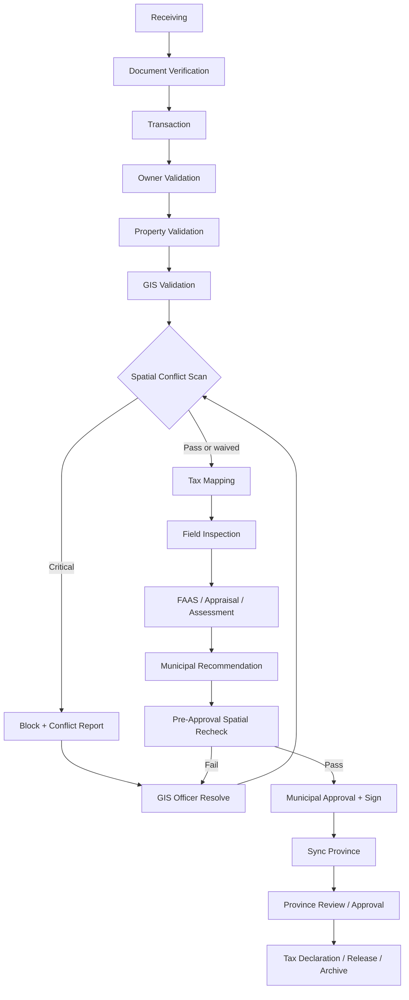
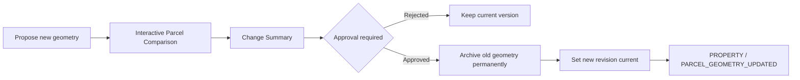

# 21 — GIS Workflow Diagrams

## Assessor + GIS integrated flow

```mermaid
flowchart TD
  Rec[Receiving] --> Docs[Document Verification]
  Docs --> Tx[Transaction]
  Tx --> Owner[Owner Validation]
  Owner --> Prop[Property Validation]
  Prop --> GisVal[GIS Validation]
  GisVal --> SpatialCheck{Spatial Conflict Scan}
  SpatialCheck -->|Critical| Block[Block + Conflict Report]
  Block --> GisFix[GIS Officer Resolve]
  GisFix --> SpatialCheck
  SpatialCheck -->|Pass or waived| TaxMap[Tax Mapping]
  TaxMap --> Insp[Field Inspection]
  Insp --> Faas[FAAS / Appraisal / Assessment]
  Faas --> MuniRec[Municipal Recommendation]
  MuniRec --> SpatialRecheck[Pre-Approval Spatial Recheck]
  SpatialRecheck -->|Fail| GisFix
  SpatialRecheck -->|Pass| MuniAppr[Municipal Approval + Sign]
  MuniAppr --> Sync[Sync Province]
  Sync --> Prov[Province Review / Approval]
  Prov --> Td[Tax Declaration / Release / Archive]
```

## Geometry change approval flow

```mermaid
flowchart LR
  Edit[Propose new geometry] --> Compare[Interactive Parcel Comparison]
  Compare --> Summary[Change Summary]
  Summary --> Approve{Approval required}
  Approve -->|Rejected| KeepOld[Keep current version]
  Approve -->|Approved| Archive[Archive old geometry permanently]
  Archive --> Apply[Set new revision current]
  Apply --> Timeline[PROPERTY / PARCEL_GEOMETRY_UPDATED]
```
