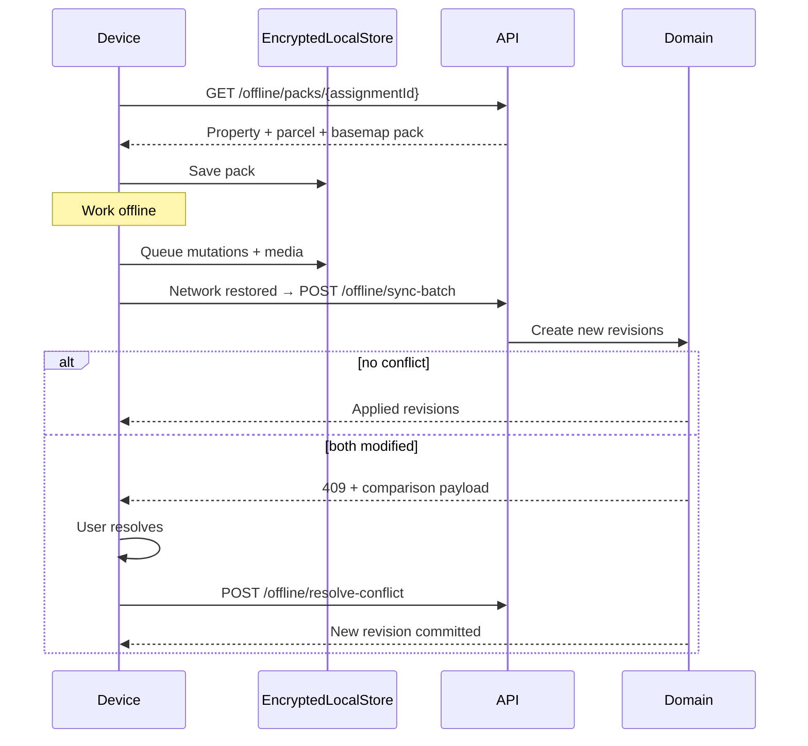
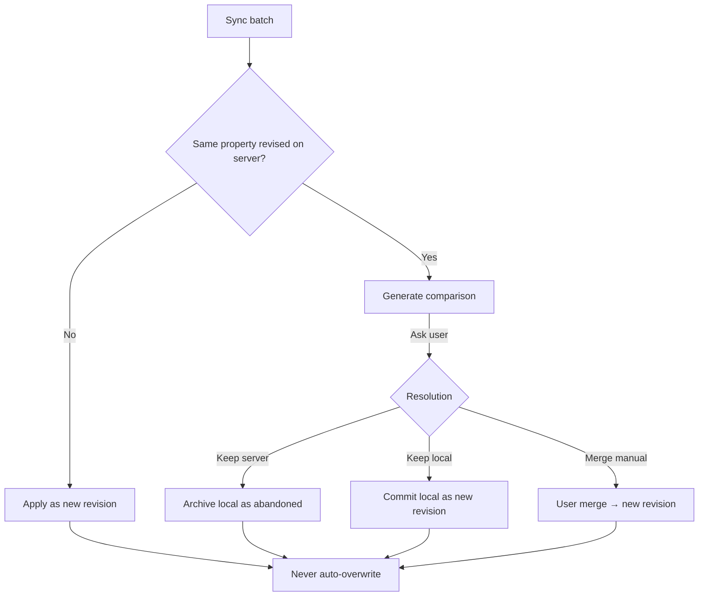

# 23 — Offline Sync & Conflicts

## Offline GIS Inspection capabilities

Inspectors can download assigned inspections and, offline:

| Capability | Notes |
| --- | --- |
| View property information | Cached JSON pack |
| View parcel map | Offline vector tiles / GeoJSON pack |
| Capture GPS | lat/lon/accuracy |
| Capture Compass Direction | degrees |
| Capture Elevation | meters |
| Take Photos | local encrypted store |
| Record Notes | text |
| Draw Sketch | GeoJSON sketch layer |
| Update Boundary (optional) | proposed geometry locally |
| Collect Signatures | stroke paths + metadata |
| Attach Supporting Documents | queued uploads |
| Save Offline | local revision queue |

## Offline synchronization flow

## Conflict resolution flow

**Rules:** Never overwrite automatically. Every synchronization creates a **new revision**.
