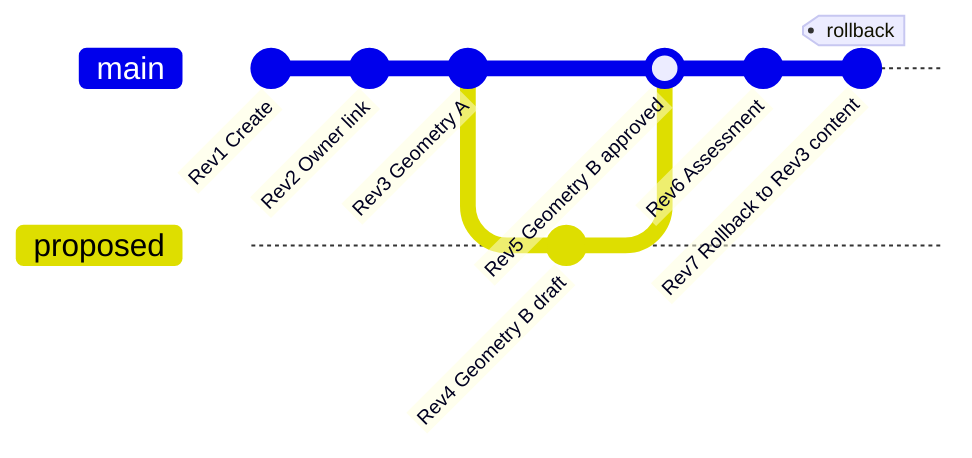

# 24 — Property Versioning (Git-like)

## Policy

Every property implements Git-like version control.

Every edit creates:

| Field | Description |
| --- | --- |
| Revision Number | Monotonic per property |
| Timestamp | UTC |
| Editor | UserId |
| Office | OfficeId / name |
| Municipality | LGU code |
| Approval Status | Draft / Pending / Approved / Rejected |
| Digital Signature | Present at signed gates |

**No update overwrites previous data.** Every revision remains accessible. **Rollback** creates a **new** revision cloned from a historical snapshot (history preserved).

## Parcel versioning diagram

## Storage model

- `property_revisions` — full attribute snapshot (jsonb) + metadata
- `parcel_geometry_versions` — geometry snapshots
- `property_units.current_revision` — pointer only

## Rollback API semantics

`POST /properties/{id}/rollback` with `{ "toRevision": 3, "reason": "..." }` → creates Rev N+1 with content of Rev 3 + timeline event.
